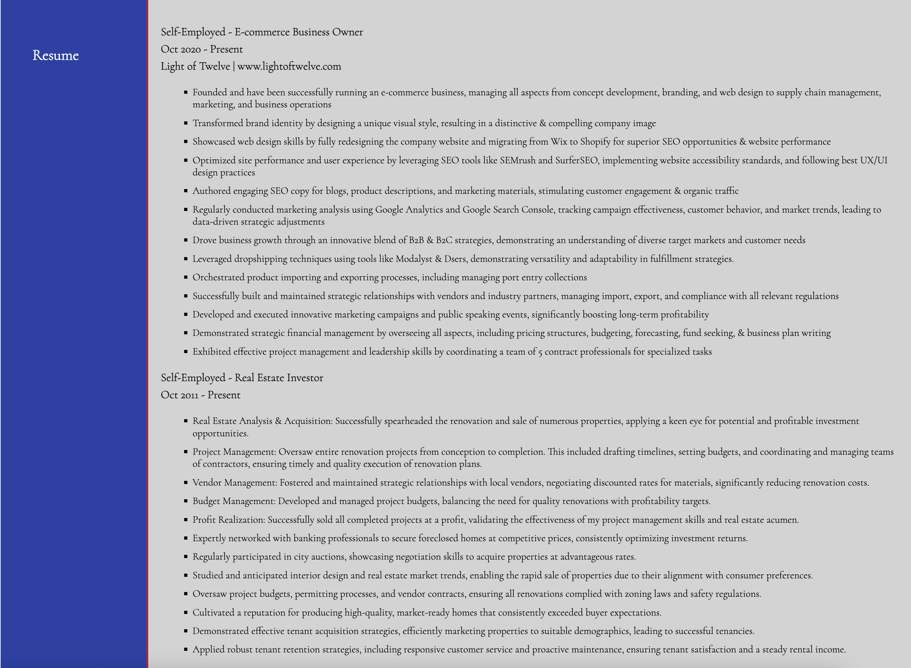

# My Portfolio Project

## Description
This project is a portfolio website showcasing my work as a developer. The website presents my name, avatar, and links to sections about myself, my work, how to contact me, and my resume. The portfolio includes images and descriptions of my applications, with links to the deployed projects. It's designed with a responsive layout that adapts to various screen sizes and devices, ensuring a smooth user experience no matter how you're accessing it.

## Usage
Navigate through the site using the links in the top navigation bar. The links in the navigation bar will scroll the page to the corresponding section:
- About Me: Provides a brief introduction to myself and what I do.
- My Work: This section showcases the applications I've built. The first application's image is larger than the others to highlight my most significant work.
- Contact Me: You'll find my contact information, including email and social media links. If you're interested in my work, please feel free to reach out.
- Resume: You'll find my resume to view.

Click on any application image under the 'My Work' section to be taken to that deployed application.

## Screenshots

## Tests
Ensure all links function correctly and the HTML and CSS have no errors.

## Live Demo
You can view the live demo of the website [here](https://lightoftwelve.github.io/portfolio/).

## Credits
This project was independently developed.

## License
N/A
